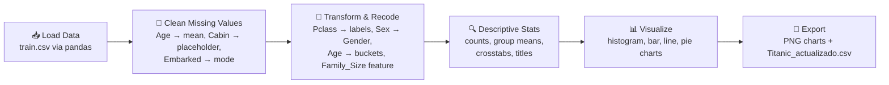
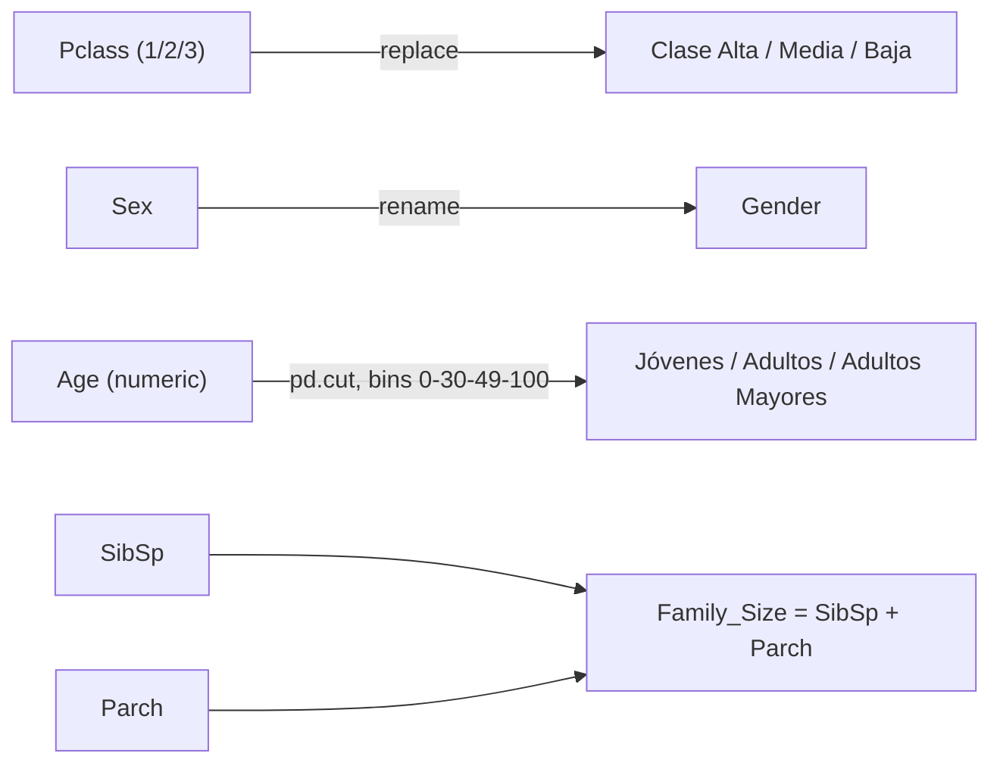
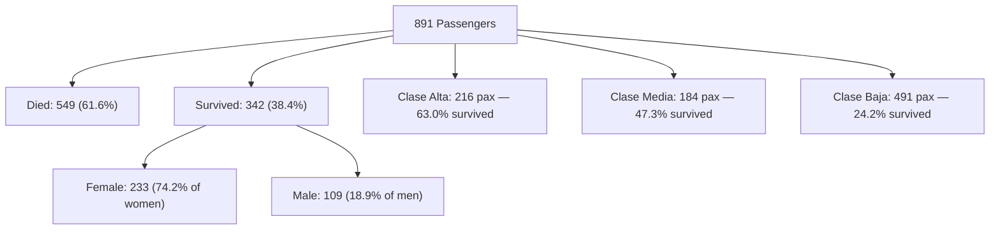

-20BEFF?logo=kaggle&logoColor=white)


# Titanic Dataset — Exploratory Analysis with pandas

Exploratory data analysis of the classic Titanic passenger dataset — cleaning, feature engineering, and visualization with pandas and matplotlib.

## Table of Contents

- [Academic Context](#academic-context)
- [Pipeline Overview](#-pipeline-overview)
- [Dataset](#-dataset)
- [Methodology](#-methodology)
- [Key Findings](#-key-findings)
- [Visualizations](#-visualizations)
- [How to Run It](#-how-to-run-it)
- [Repository Structure](#-repository-structure)
- [Credits & License](#-credits--license)

## Academic Context

Academic project by **Ludovic Delot Bravo**, undergraduate student in the
**Licenciatura en Inteligencia de Negocios (LIN)** at
**Tecnológico de Monterrey (Tec de Monterrey)**.

- **Course:** *Programación para Negocios* (Programming for Business), Semester 1 (S1)
- **Assignment:** *Actividad 7 — Análisis del dataset Titanic*
- **Tools:** Python, pandas, matplotlib (originally developed in Google Colaboratory)

Console output in the script is in Spanish, matching the original coursework submission.

## 🔄 Pipeline Overview

`titanic_analysis.py` runs as a single linear script. The diagram below shows the stages it walks through, from raw CSV to saved charts and an updated dataset.



### Data-Cleaning Detail

```mermaid
flowchart TD
    subgraph Missing["Missing Values Detected"]
        Age[Age<br/>177 missing]
        Cabin[Cabin<br/>687 missing]
        Embarked[Embarked<br/>2 missing]
    end
    Age -->|fillna: column mean| Age2[Age filled]
    Cabin -->|fillna: 'Sin Registro'| Cabin2[Cabin filled]
    Embarked -->|fillna: mode 'S'| Embarked2[Embarked filled]
    Age2 --> Clean[✅ isnull().sum == 0]
    Cabin2 --> Clean
    Embarked2 --> Clean
```

### Feature Engineering Detail



### Survival Outcome Breakdown



## 📦 Dataset

The data (`data/train.csv`) is the well-known **Titanic - Machine Learning
from Disaster** dataset, originally published by
[Kaggle](https://www.kaggle.com/competitions/titanic/data) and widely used
as an open, public teaching dataset. It contains historical, publicly
available passenger records from the RMS Titanic (1912) — no private or
sensitive personal data was added. The version used here includes the same
891 passenger records as the standard Kaggle `train.csv`, with `Title` and
`Last Name` split out as additional columns for the exercise.

The dataset is provided here for educational/reproducibility purposes
alongside the coursework it was used in.

## 🧹 Methodology

1. **Load & inspect** — reads `data/train.csv`, prints `info()`, `shape`, `head()`, `tail()`.
2. **Detect & clean missing values** — `isnull().sum()` before/after; fills `Age` with the column mean, `Cabin` with `"Sin Registro"`, and `Embarked` with the most common port (`"S"`).
3. **Recode columns** — maps `Pclass` (1/2/3) to readable labels (`Clase Alta`, `Clase Media`, `Clase Baja`) and renames `Sex` to `Gender`.
4. **Descriptive statistics** — survivor counts, passengers per class, average fare/age by group, `groupby` aggregations, `crosstab` of survival by gender and by class, and passenger title counts.
5. **Feature engineering** — buckets `Age` into ranges (`Jóvenes` 0–30, `Adultos` 31–49, `Adultos Mayores` 50–100) and creates a `Family_Size` feature from `SibSp` + `Parch`.
6. **Visualization** — generates four charts (see below) and saves each as a `.png`.
7. **Export** — writes the transformed dataframe to `Titanic_actualizado.csv`.

## 🔍 Key Findings

Numbers below were computed by running the script's cleaning/transform steps directly against `data/train.csv` (891 passengers, 342 survivors overall).

| Metric | Value |
|---|---|
| Overall survival rate | 342 / 891 = **38.4%** |
| Female survival rate | 233 / 314 = **74.2%** |
| Male survival rate | 109 / 577 = **18.9%** |
| Survival rate — Clase Alta (1st) | 136 / 216 = **63.0%** |
| Survival rate — Clase Media (2nd) | 87 / 184 = **47.3%** |
| Survival rate — Clase Baja (3rd) | 119 / 491 = **24.2%** |
| Avg. fare — Clase Alta | **$84.15** |
| Avg. fare — Clase Media | **$20.66** |
| Avg. fare — Clase Baja | **$13.68** |
| Passengers by class | Clase Baja 491, Clase Alta 216, Clase Media 184 |

**Takeaways:**
- Survival was strongly associated with **gender**: women survived at nearly **4x** the rate of men.
- Survival was strongly associated with **passenger class**: 1st-class passengers survived at roughly **2.6x** the rate of 3rd-class passengers.
- Average fare paid scaled directly with class, confirming `Pclass` as a proxy for socioeconomic status.
- Most 3rd-class passengers (55% of the dataset) had the lowest survival odds, consistent with historical "women and children first, upper decks first" evacuation accounts.

## 📊 Visualizations

The script generates and saves four charts:

| Chart | Type | File | What it shows |
|---|---|---|---|
| Survival histogram | Histogram | `Grafica_Histograma_muertos_sobrevivientes.png` | Distribution of the binary `Survived` column (0 = died, 1 = survived), showing the raw death/survival imbalance. |
| Survival by gender | Horizontal bar | `Grafica_Barras_Muertos_sobrevivientes_Genero.png` | Crosstab of `Survived` × `Gender`, comparing counts of men and women who died vs. survived. |
| Survival by class | Line chart | `Grafica_Linea_Clase_Sobrevivientes.png` | Crosstab of `Pclass` × `Survived`, tracing how survival counts change across passenger classes. |
| Passengers by class | Pie chart | `Gráfica_Pie_Tipo_Clase.png` | Proportion of passengers in each class (Clase Alta / Media / Baja), with exploded slices and percentage labels. |

Generated images are excluded from version control (see `.gitignore`) — run the script to reproduce them locally.

## 🚀 How to Run It

```bash
# 1. Clone the repo
git clone https://github.com/<your-username>/bsc-titanic-pandas-eda.git
cd bsc-titanic-pandas-eda

# 2. Install dependencies
pip install -r requirements.txt

# 3. Run the analysis
python titanic_analysis.py
```

The script reads `data/train.csv` and prints its analysis to the console,
saving chart images (`.png`) and an updated CSV (`Titanic_actualizado.csv`)
in the working directory.

## 📁 Repository Structure

```
.
├── README.md
├── titanic_analysis.py     # main analysis script
├── data/
│   └── train.csv            # Titanic dataset (Kaggle, public)
├── requirements.txt
└── .gitignore
```

## 🎓 Credits & License

- **Author:** Ludovic Delot Bravo — Licenciatura en Inteligencia de Negocios (LIN), Tecnológico de Monterrey
- **Course:** Programación para Negocios (S1), *Actividad 7*
- **Dataset:** [Titanic - Machine Learning from Disaster](https://www.kaggle.com/competitions/titanic/data) (Kaggle, public domain teaching dataset)
- **Code:** Provided for educational and portfolio purposes. Feel free to reference or adapt for learning; please attribute if reused.
